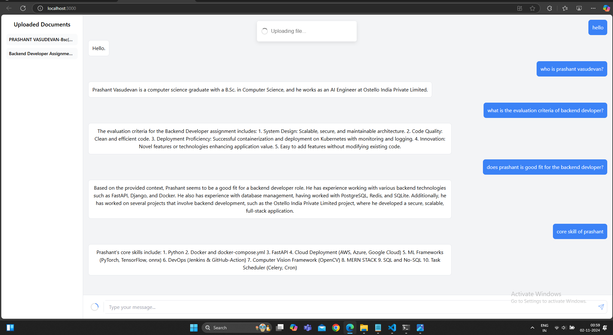

# Chat with Any Type of Documents

This project enables users to upload various document types (PDF, PPT, DOCX, CSV) and chat interactively with the content through a conversational interface. Powered by advanced embeddings and a state-of-the-art language model, it provides a secure and personalized experience for each user.

## Demo Video
[Watch Demo Video Showcasing Chabot in action](https://drive.google.com/file/d/1CKM2Ns3uzQ1amhYKo5JDfaA_z2M6cD-d/view)

## Tech Stack
- **Backend**: Python, FastAPI, LangChain, ChromaDB, NVIDIA Embedding, Unstructured.io, Redis, Docker
- **LLM**: GROQ Llama 3.1 70b
- **Frontend**: ReactJS
- **Authentication**: JWT, OAuth2.0
- **Storage & Session Management**: Redis
- **Containerization**: Docker

---

## Project Setup

### Backend Setup
1. Navigate to the `server` directory:
   ```bash
   cd server
   ```
2. Deploy the backend using Docker:
   ```bash
   bash deploy.sh
   ```

### Frontend Setup
1. Navigate to the `frontend` directory:
   ```bash
   cd frontend
   ```
2. Deploy the frontend:
   ```bash
   bash deploy.sh
   ```

---

## Functional Requirements

1. **User Authentication & Authorization**:
   - **Registration** and **login** with token-based session management.
   - **JWT** tokens stored securely in Redis for session validation.
   - Passwords are hashed using `bcrypt` and stored securely.
   - Only authenticated users have access to chat and document-related services.

2. **Document Upload & Embedding**:
   - Users upload various document types (PPTX, PDF, CSV, DOCX).
   - Document embeddings are generated with NVIDIA Embeddings via Unstructured.io.
   - User-specific embeddings are saved in ChromaDB for private access.
   - Documents are deleted post-processing for enhanced privacy.

3. **Chat Interface with Retrieval-Augmented Generation (RAG)**:
   - Users can submit queries related to document contents or general questions.
   - The chatbot dynamically determines query context and retrieves responses.
   - All queries and responses are stored in Redis to maintain conversation context.

4. **Chat History Retrieval**:
   - Users can view the latest chat history for a continuous and personalized conversation experience.

5. **Security & Data Privacy**:
   - Embeddings and user data are stored in user-specific collections for isolation.
   - Redis stores only essential session and chat data, ensuring user privacy.

---

## Class Design

### 1. **User**
   - **Attributes**: `user_id`, `email`, `password_hash`, `session_token`
   - **Functions**:
     - `register_user(email, password)`: Registers a new user.
     - `login_user(email, password)`: Authenticates and logs in the user.
     - `verify_token(session_token)`: Verifies the JWT for session continuity.

### 2. **DocumentProcessor**
   - **Attributes**: `file_path`, `user_id`
   - **Functions**:
     - `upload_document(file_path)`: Uploads user documents.
     - `process_and_embed_document(file_path, user_id)`: Generates embeddings for the document.
     - `delete_document(file_path)`: Deletes document after embedding.

### 3. **ChatAgent**
   - **Attributes**: `user_id`, `query`
   - **Functions**:
     - `send_message(query, user_id)`: Sends a query message.
     - `generate_response(query)`: Retrieves or generates a response using LLM.
     - `store_message(user_id, message, sender)`: Stores each message in Redis for history.

### 4. **SessionManager**
   - **Attributes**: `user_id`, `session_token`
   - **Functions**:
     - `generate_jwt(user_id)`: Generates a JWT token for user sessions.
     - `verify_jwt(session_token)`: Validates the session token.
     - `logout_user(user_id)`: Logs the user out and removes the session.

---

## Interaction Design

1. **User** interacts with **SessionManager** for secure authentication.
2. **User** uploads documents via **DocumentProcessor**, which embeds the documents in **ChromaDB**.
3. **User** submits queries to **ChatAgent**, which uses Redis to manage chat history and generate responses using embeddings and the LLM.

---

## Open-Close Relationships

- **ChatAgent** is designed for extensibility, allowing the integration of new LLM models without altering its core structure.
- **DocumentProcessor** can support additional document types by implementing interface methods, enabling easy extension for future requirements.

---

## Dependency Management

To maintain modularity and flexibility:
- **SessionManager** and **ChatAgent** interact via interfaces, facilitating easy adjustments in session management.
- **DocumentProcessor** integrates with Unstructured.io, which can be abstracted to support other embedding tools as needed.

---

## Demo Images



---

## Low-Level Design (LLD)


